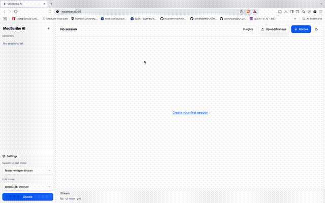

# MedScribeAI

AI-Powered Medical Note Scriber

---

## About

MedScribeAI is an advanced AI-driven medical note scribing solution designed to streamline healthcare documentation by automatically transcribing and generating structured clinical notes from medical consultation recordings. It aims to reduce administrative burdens on healthcare providers while improving accuracy and efficiency in clinical record-keeping.

---

## Features
Real-time or batch transcription of medical consultations/recordings

AI-powered natural language processing to extract key medical information

Generation of structured medical notes for easy review and storage

Multi-language and medical terminology support

Multi-session data management to track and organise patient consultations over time

Customisable note templates allowing tailored documentation formats per clinician or specialty

---

## Technologies Used

- Frontend: TypeScript, React/Next.js
- Backend: Python (fastAPI)
- AI/ML: Faster-whisper, Ollama / custom NLP pipelines

---

## Getting Started

### Prerequisites

- Node.js and pnpm (for frontend)
- Python 3.7+ (for backend)
- Ollama (for local AI hosting)
### Installation

1. Clone the repo:
git clone https://github.com/brianhuynh125/MedScribeAI.git
cd MedScribeAI

2. Install frontend dependencies:
cd frontend
npm install
pnpm install

4. Install backend dependencies:
cd ../backend
pip install -r requirements.txt

### Running the Application

Start backend server
cd backend
uvicorn app.main:app --reload

Start frontend server (in separate terminal)
cd frontend
pnpm build
pnpm dev

Then open `http://localhost:8080` in your browser.

---

## Usage

- Upload or record a medical consultation audio
- The AI transcribes and generates a structured note
- Edit or export notes for patient records

---

## Future Scope

While it's just a quick prototype to demo the capability of AI in healthcare. Here are some to-do's in the future for this project:

1. Add options for api keys (OpenAi, Gemini, NeMo).
2. Add more medical-fine-tuned models.
3. Add a directory of customisable prompts based on the role of the users: GPs, Specialists, Allied Heath Practitioners,...
4. Complete the Insight AI feature, allowing to have a corpus of patient's sessions and functional AI chat.
5. Prompt caching: build prompt caching architecture.
6. Model finetuning: fintuning models on: 1) Users style of speech 2) Consultation's notes.

---

## Contributing

Contributions are welcome! Please open issues or PRs for bug fixes, features, or improvements.

---

## License

This project is licensed under the Apache-2.0 License.

---

## Contact

For questions, please reach out via the GitHub repo.

